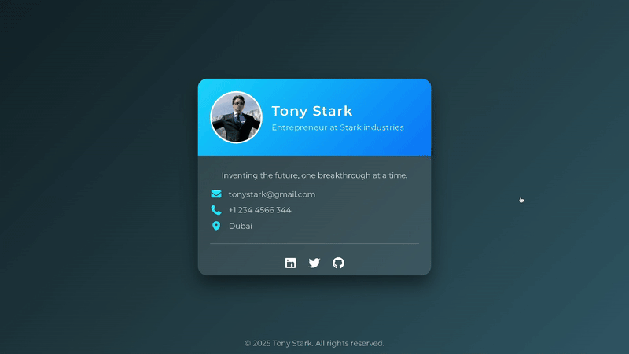

# 💳 Digital Business Card 

A stylish interactive 3D **business card flip** effect created using HTML, CSS, and Font Awesome icons.  
Click or hover to flip the card and reveal the back side. Perfect for portfolios, personal branding, or web experiments.

---

## 🌐 Live Demo
[**View Website**](https://falconishere.github.io/business-card-flip/)

---

## 📸 Demo

---

## 🚀 Features
- **Elegant Glassmorphism UI**
- **Smooth 3D Flip Animation**
- Front and back card design
- Integrated **Font Awesome** icons
- Fully **responsive**
- Optimized for GitHub Pages

---

## 🛠 Tools & Technologies
**Languages & Frameworks**
- HTML5  
- CSS (Animations, Transforms)  
 

**Libraries & Assets**
- [Font Awesome](https://fontawesome.com/) (Icons)  
- Google Fonts (Typography)  

**Tools**
- VS Code  
- Git & GitHub  

---

## 📂 Project Structure
business-card-flip/
│
├── index.html # Main HTML file
├── style.css # Styles and animations

---
## 🙌 Acknowledgements
- [Tailwind CSS](https://tailwindcss.com) – Utility-first CSS framework for responsive design.
- [Google Fonts](https://fonts.google.com) – Typography customization.
- [Font Awesome](https://fontawesome.com) – Icon set used for ratings and trivia.
- **Christ University** – For providing the UI/UX course framework that inspired this project.

---

## 👥 Contributors
- Abhishan Francis
- Abel Alexader
- Misheal Julian
